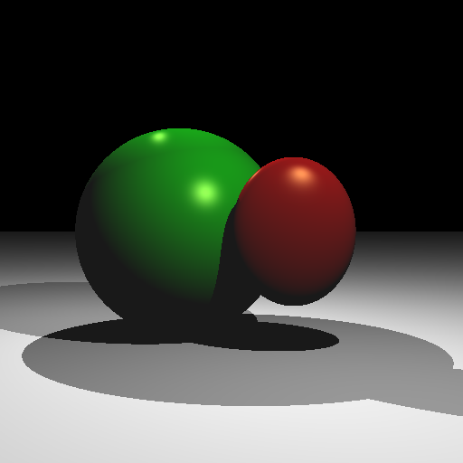
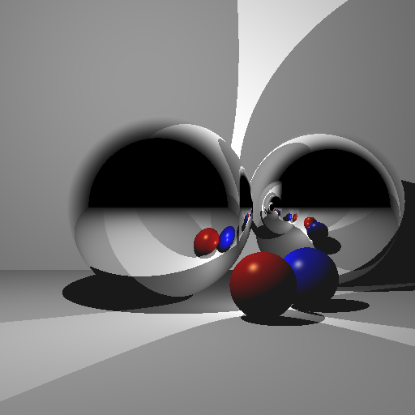
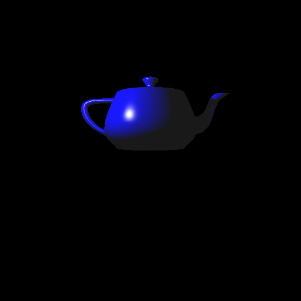
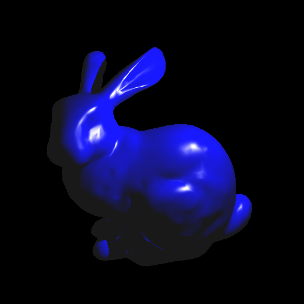

# Ray Tracer

**Build Steps:**

1. Create a build directory and navigate into it:

   ```
   > mkdir build
   > cd build
   ```

2. Run CMake to configure the project:

   ```
   cmake ..
   ```

3. Compile the code using the generated Makefile:

   ```
   make -j4
   ```

4. To run the program use

```
./A6 <SCENE> <IMAGE SIZE> <IMAGE FILENAME>
```

**Images:**






